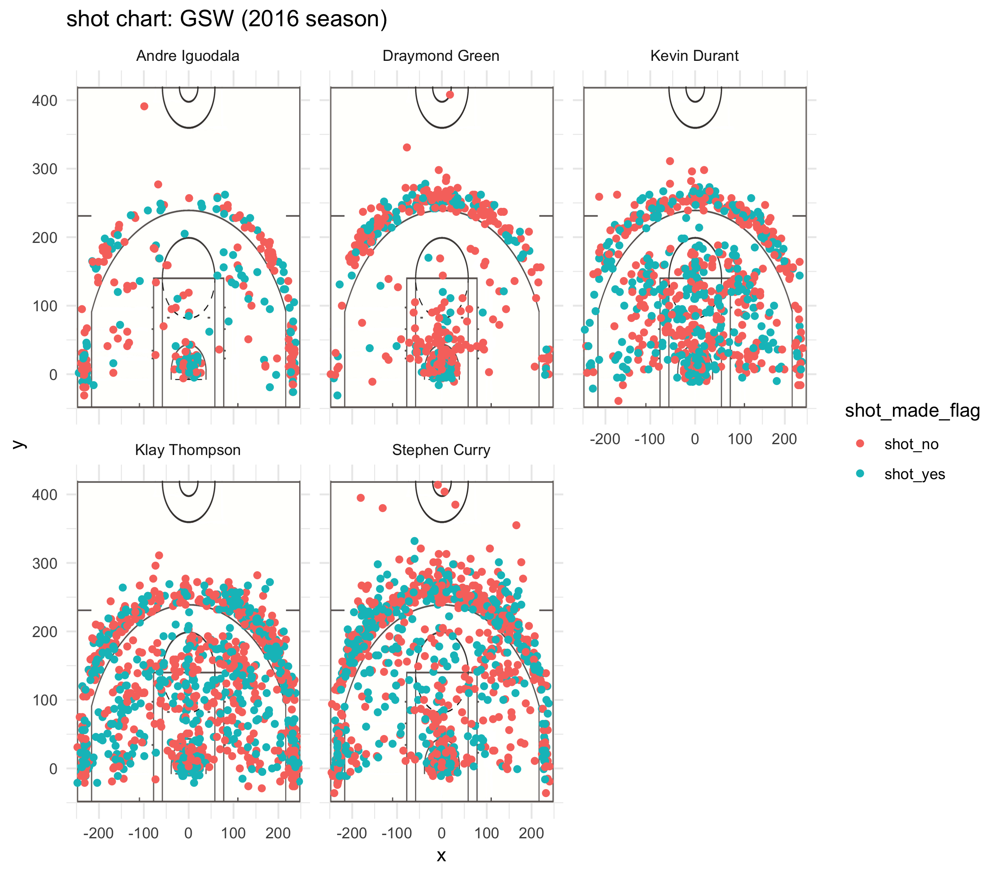

```{r, echo=FALSE}
library(dplyr)
library(grid)
```

```{r setup, include=FALSE}
knitr::opts_chunk$set(echo = TRUE)
```


## 2PT Effective Shooting % by Player
```{r echo = FALSE}
shots_data <- read.csv(file = "../data/shots-data.csv")
two_point <- filter(shots_data, shot_type == "2PT Field Goal")
two_point <- summarise(
  group_by(two_point, name),
  TotalShots = sum(shot_type == "2PT Field Goal"),
  ShotsMade = sum(shot_made_flag == "shot_yes"),
  PercentMade = ShotsMade / TotalShots
)
two_point <- arrange(two_point, desc(PercentMade))
knitr::kable(two_point)

```


## 3PT Effective Shooting % by Player
```{r echo = FALSE}
shots_data <- read.csv(file = "../data/shots-data.csv")
three_point <- filter(shots_data, shot_type == "3PT Field Goal")
three_point <- summarise(
  group_by(three_point, name),
  TotalShots = sum(shot_type == "3PT Field Goal"),
  ShotsMade = sum(shot_made_flag == "shot_yes"),
  PercentMade = ShotsMade / TotalShots
)
three_point <- arrange(three_point, desc(PercentMade))
knitr::kable(three_point)
```


## Effective Shooting % by Player
```{r echo = FALSE}
all_points <- summarise(
  group_by(shots_data, name),
  TotalShots = sum(shot_type == "3PT Field Goal" | shot_type == "2PT Field Goal"),
  ShotsMade = sum(shot_made_flag == "shot_yes"),
  PercentMade = ShotsMade / TotalShots
)
all_points <- arrange(all_points, desc(PercentMade))
knitr::kable(all_points)
```

## Shot chart of GSW(2016)
```{r out.width='80%', echo = FALSE, fig.align= 'center'}

```

#Introduction
As everyone know, GSW is the best team in NBA. This workout is going to analyze how GSW be the best team in NBA league.

#Motivation
GSW is now one of the best team in NBA league. There are five popular star players in GSW, and eacth of them have their own role for team. Curious about their roles and scores distribution, so we are going to see score distribution of each player and analyze their character.

#Analysis
As we can see in 2PT table, Kevin have the most two points totalshots and shotsmade, and Andre Iguodala have the lowest two points totalshots and shotsmade. From this data, we get to know that Kevin uses his height to get lots of totalshots and shotsmade. In contrast, Andre Iguodala have lowest shotsmade, but he has the highest percentage of goal successes. It means he usually attempts the shot when he has a good chance. 
  Also, 3PT table shows GSW have the best 3 PTs shooters in the league. Curry gets 280 shotmade out of 687 totalshots, and Thompson gets 246 shotmades out of 580 totalshots. Even though both have lots of totalshots, they have a good percentage of 3 PTs shoot success(Curry has 40%, Thompson has 42%). Kevin Durant, who got into GSW this season, have 38% of shotsmade. Iguodala and Green get 58 and 74 shotsmade, which is about 35% of success rate.
  Third table shows effective shooting rate of each player.Durant gets 495 shotmades out of 915 totalshots, which is 54% of success. This means he is the key player of GSW. Curry tries 1250 shoots and make 575 successes, which is 46.7% of success. Another key player, Klay Thompson have 47% success rate. These players are the best players in NBA.
